# UTCSUD - Game Level For Tremulous
 

## Overview: UTCS Remastered

UTCSUD is a game level by Matthias "Masmblr" Peters for the open source game [_Tremulous_](https://tremulous.net/).

Map Description: 
> This is a Tremulous map that pays homage to Adam "Chompers" Wilkinson's iconic layout from UTCS, while presenting an fresh and revitalized gaming experience. Constructed from the ground up, this map utilizes the eX Texture Pack to elevate its visuals.
> 
> Prepare to be enthralled by not one, but two versions of this map. The standard Tremulous map will captivate you with its refined design and strategic gameplay. However, for those seeking an even more immersive adventure, the experimental Tremulous 1.3 version awaits. This rendition boasts Bumpmapping, Sun-Shafts support and a variety of other effects that will leave you in awe. You will need to download the [Tremulous 1.3 client](http://files.grangerhub.org/#files%2Fdownloads%2Fclients%2Falpha).
> 
> Each team will find two distinct Stage doors at their disposal. The first door, located in the heart of each team's territory, opens its gateway upon reaching Stage 2. The second door, situated in the rear of each team's domain, unlocks during Stage 3.
 
* * *

## Screenshots:
Tremulous screenshots (4.4): </br>
[](meta/preview_levelshots/1.jpg)
[](meta/preview_levelshots/2.jpg)
[](meta/preview_levelshots/3.jpg)
[](meta/preview_levelshots/4.jpg)
[](meta/preview_levelshots/5.jpg)
[](meta/preview_levelshots/6.jpg)
[](meta/preview_levelshots/7.jpg)
[](meta/preview_levelshots/8.jpg)
[](meta/preview_levelshots/9.jpg)
[](meta/preview_levelshots/10.jpg)
[](meta/preview_levelshots/11.jpg)
[](meta/preview_levelshots/12.jpg)

Tremulous 1.3 (inofficial) ([GrangerHub](http://www.Grangerhub.org/)): </br>
[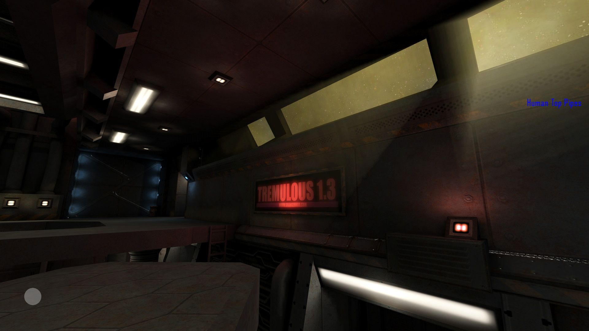](meta/preview_levelshots_trem1.3/1.jpg)
[](meta/preview_levelshots_trem1.3/2.jpg)
[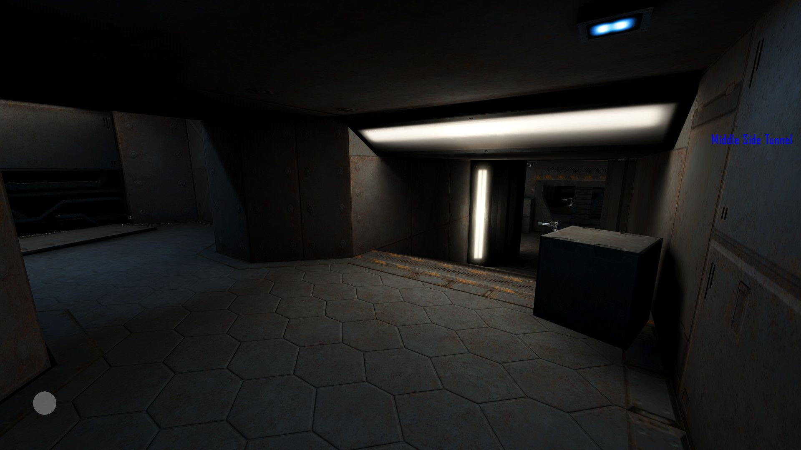](meta/preview_levelshots_trem1.3/3.jpg)
[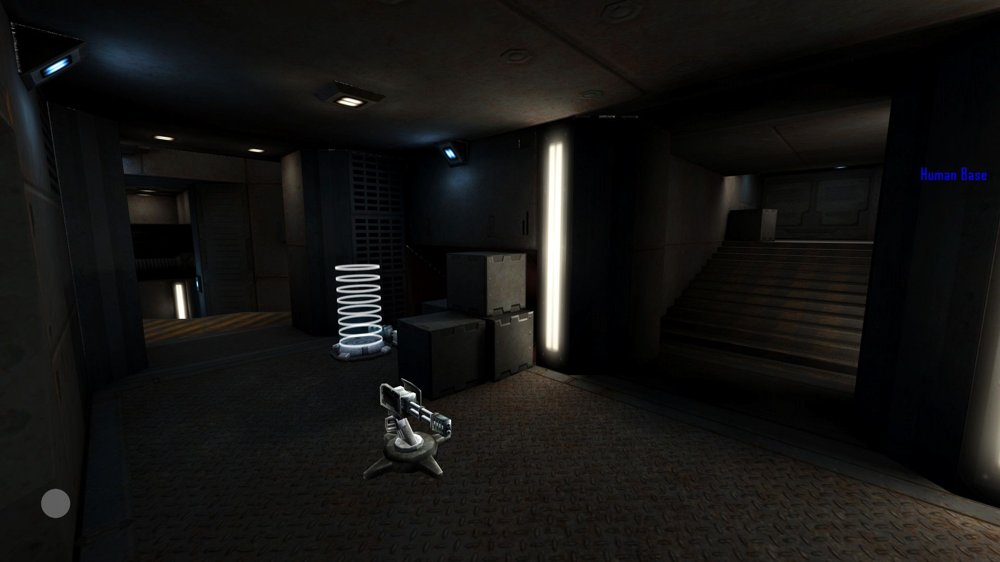](meta/preview_levelshots_trem1.3/4.jpg)
[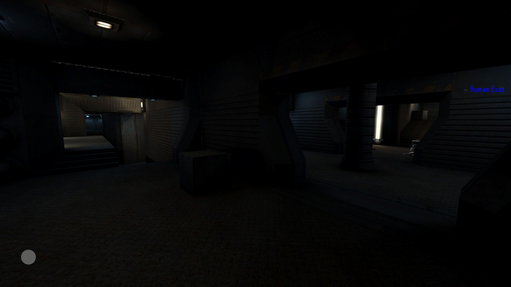](meta/preview_levelshots_trem1.3/5.jpg)
[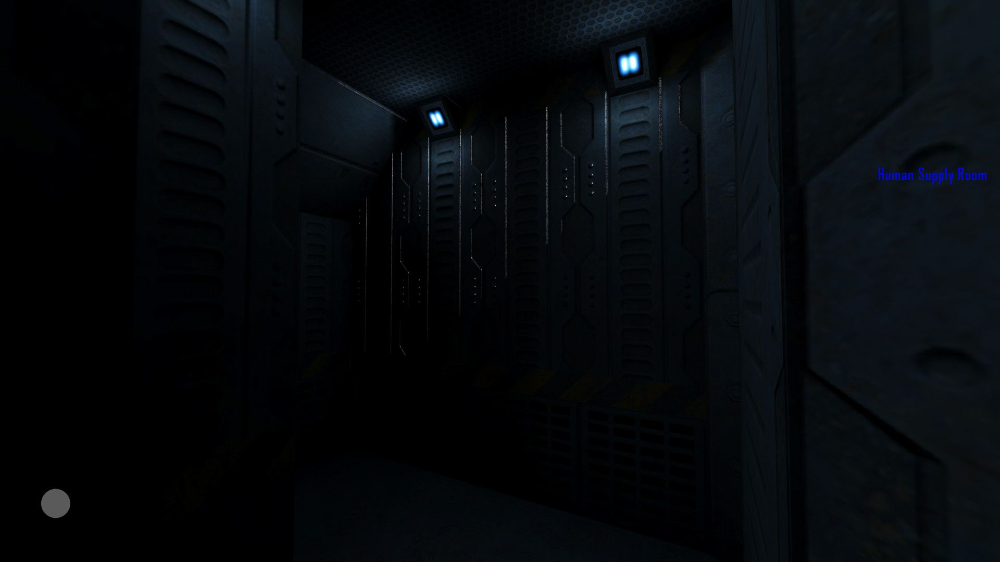](meta/preview_levelshots_trem1.3/6.jpg)
[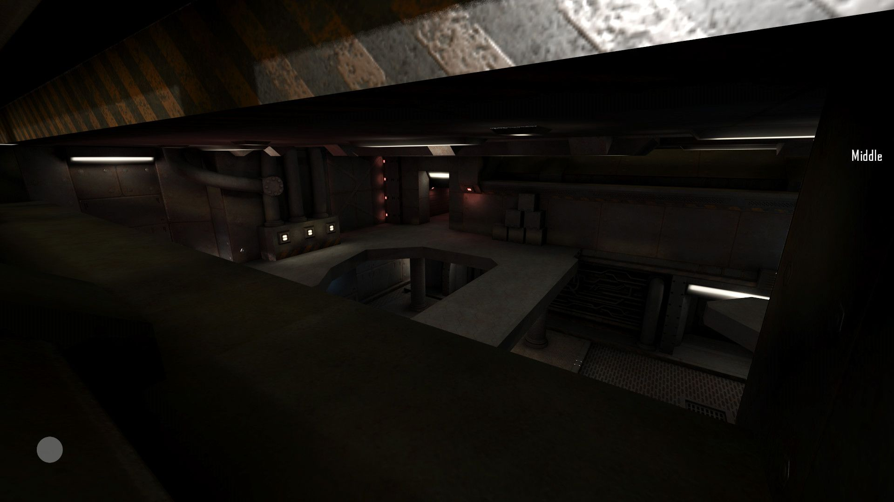](meta/preview_levelshots_trem1.3/7.jpg)
[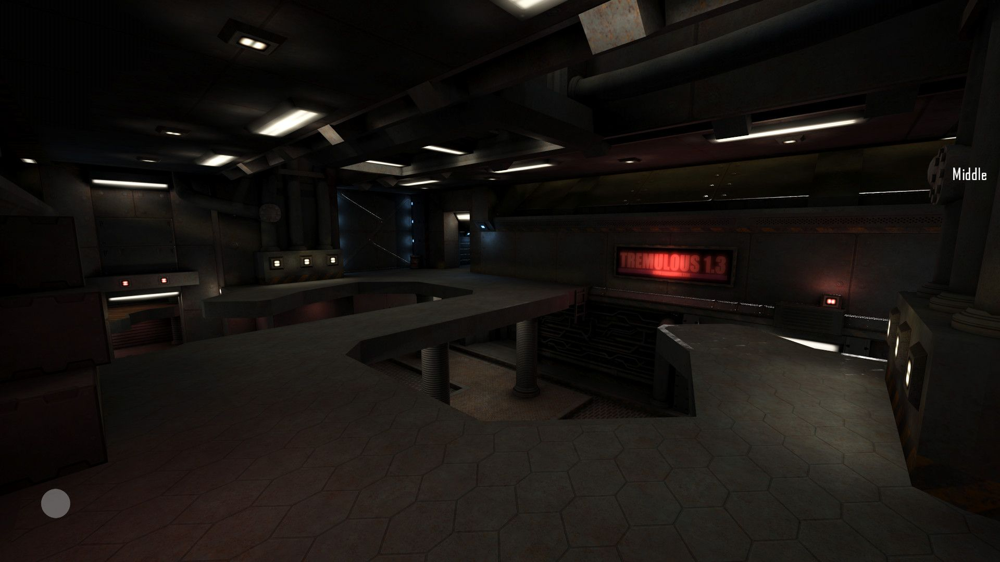](meta/preview_levelshots_trem1.3/8.jpg)
[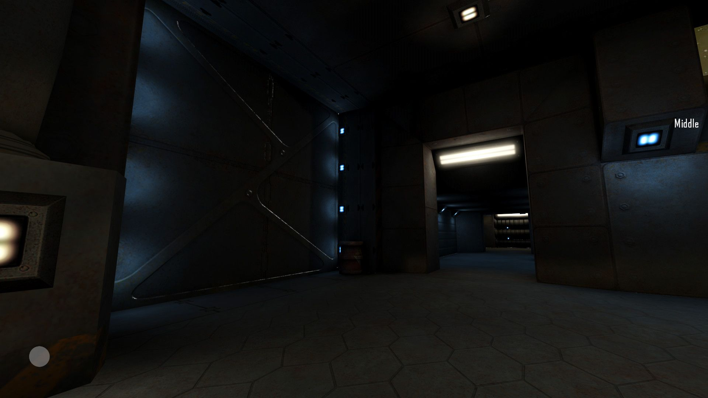](meta/preview_levelshots_trem1.3/9.jpg)
[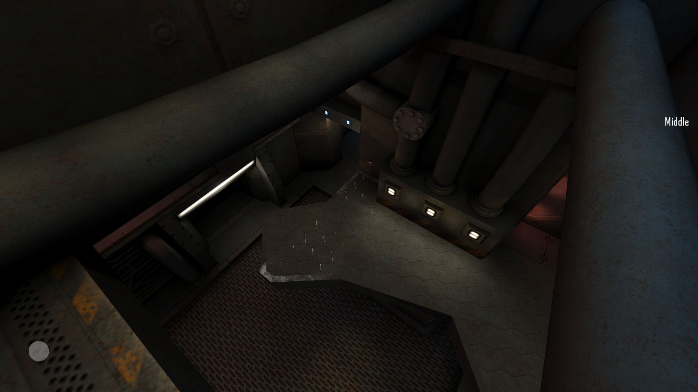](meta/preview_levelshots_trem1.3/10.jpg)
[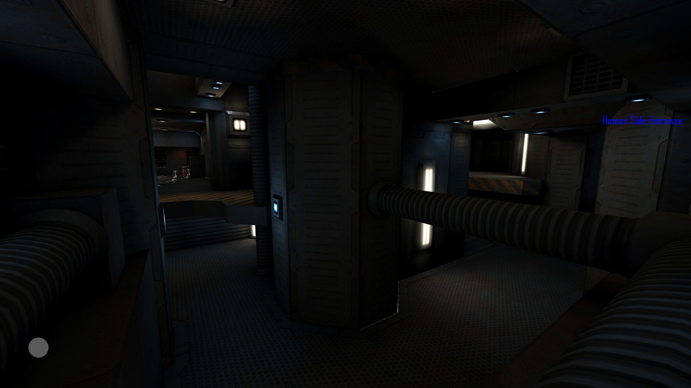](meta/preview_levelshots_trem1.3/11.jpg)
[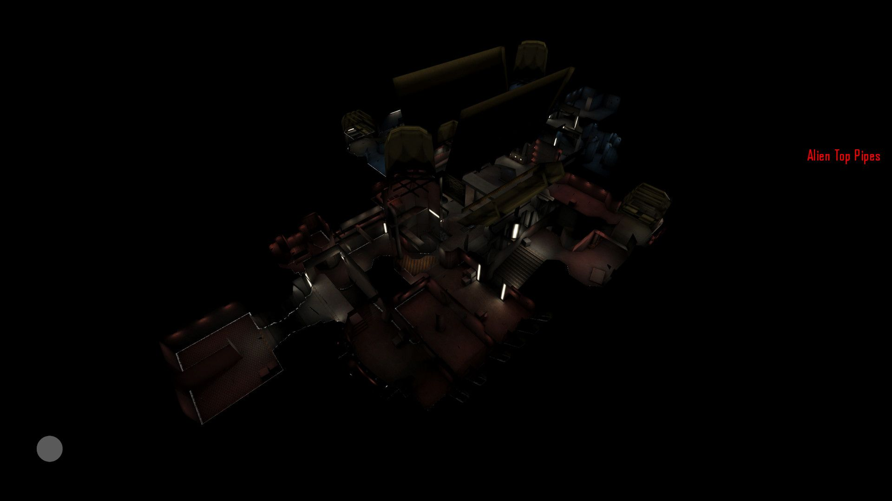](meta/preview_levelshots_trem1.3/12.jpg)
[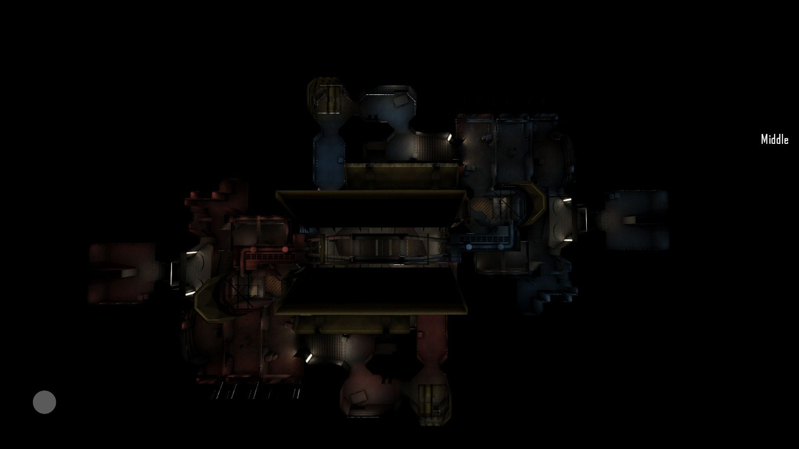](meta/preview_levelshots_trem1.3/13.jpg)

## Version History: **Tremulous**
| Version: | Date:        | Status: | Release Build (.pk3):       
| ------- | ------------- | ------: | -----------------: |
| 1.0 - 3.0    | 01/01/2015  | alpha | :x:        |     
| 4.0     | 16/10/2015  | alpha | :x:        |     
| 4.1     | 19/10/2015  | beta | :x:        |    
| 4.2     | 07/11/2015  | beta | :x:        |  
| 4.3     | 08/11/2015  | beta | :x:        |  
| 4.4     | 06/08/2023  | final | [💾](https://github.com/Masmblr/map-UTCSUD_src/releases/) |

## Version History: **Tremulous 1.3 (inofficial)**
| Version: | Date:        | Status: | Release Build (.pk3):       
| ------- | ------------- | ------: | -----------------: |
| 1.1 / 1.1     | 15/10/2016  | experimental beta | [💾](https://github.com/Masmblr/map-UTCSUD_src/releases/) |

## How-To
**Binary**:
1. Download the release package.
2. Save the *.pk3 file to the following directory: `/%PATH%/Tremulous/base/`.
3. Start the Tremulous game and select "Create Server" with the desired map.

**Source**:
1. Download the [source release](https://github.com/Masmblr/map-UTCSUD_src/releases/) and the [tremulous-common-files](https://github.com/Masmblr/tremulous-map-common/releases/tag/v1.0).
2. Extract the files to the default installation directory. It should look like this:

```
DRIVE:/%PATH%/tremulous/
|   tremulous.exe
|   tremulous.x86
|   ...
+---base
|   |   autogen.cfg
|   |   data-1.1.0.pk3
|   |   map-atcs-1.1.0.pk3
|   |   ...
|   +---env
|   +---maps 
|   +---models 
|   +---scripts
|   +---sounds
|   \---textures
```
1. Download [NetRadiant Level Editor](https://netradiant.gitlab.io/page/download/).
2. Launch NetRadiant and select "Tremulous" as your game setting.
3. Open the '.map' file located in the directory `/%PATH%/tremulous/base/maps` and, from the menu, choose 'Build -> 'Build with final settings.'
4. Start the Tremulous game with `-sv_pure 0 -devmap MAPNAME`. Make sure to replace "MAPNAME" with the actual name of the map you compiled.

## Development Tools:
Photoshop CS6 \
[Audacity](https://www.audacityteam.org/) \
[NetRadiant](https://netradiant.gitlab.io/) \
[Q3Map2](http://q3map2.robotrenegade.com/)

## Related Resources:
Official Tremulous website: https://tremulous.net </br>
NET Radiant Level-Editor: https://netradiant.gitlab.io </br>
Master-Server-List: http://dpmaster.deathmask.net/?game=tremulous </br>
Unofficial successor "Unvanquished": https://unvanquished.net

## Legal Information and Attribution
Some assets may be derivative works or subject to different licenses. Please refer for author and license details. Note that some files may have been modified. Below is a list of files and their legal statuses.

**Tremulous:**
***
levelshots\utcsud.jpg <sup>[1](#Credit-1)</sup> \
maps\utcsud.map <sup>[1](#Credit-1)</sup> \
scripts\shaderlist.txt <sup>[1](#Credit-1)</sup> \
scripts\utcsud.arena <sup>[1](#Credit-1)</sup> \
scripts\utcsud.shader <sup>[1](#Credit-1)</sup> \
textures\utcsud\blk.jpg <sup>[1](#Credit-1)</sup> \
textures\utcsud\credits.jpg <sup>[1](#Credit-1)</sup> \
textures\utcsud\credits_lines.jpg <sup>[1](#Credit-1)</sup> \
textures\utcsud\utcsud_01.jpg <sup>[2](#Credit-2)</sup> \
textures\utcsud\utcsud_02.jpg <sup>[2](#Credit-2)</sup> \
textures\utcsud\utcsud_03.jpg <sup>[1](#Credit-1)</sup> \
textures\utcsud\utcsud_03_blend.jpg <sup>[1](#Credit-1)</sup> \
textures\utcsud\utcsud_03_blend_blue.jpg <sup>[1](#Credit-1)</sup> \
textures\utcsud\utcsud_03_blend_red.jpg <sup>[1](#Credit-1)</sup> \
textures\utcsud\utcsud_03b.jpg <sup>[1](#Credit-1)</sup> \
textures\utcsud\utcsud_03r.jpg <sup>[1](#Credit-1)</sup> \
textures\utcsud\utcsud_04.jpg <sup>[2](#Credit-2)</sup> \
textures\utcsud\utcsud_04_blend.jpg <sup>[2](#Credit-2)</sup> \
textures\utcsud\utcsud_05.jpg <sup>[2](#Credit-2)</sup> \
textures\utcsud\utcsud_06.jpg <sup>[2](#Credit-2)</sup> \
textures\utcsud\utcsud_07.jpg <sup>[2](#Credit-2)</sup> \
textures\utcsud\utcsud_08.jpg <sup>[2](#Credit-2)</sup> \
textures\utcsud\utcsud_09.jpg <sup>[2](#Credit-2)</sup> \
textures\utcsud\utcsud_10.jpg <sup>[2](#Credit-2)</sup> \
textures\utcsud\utcsud_11.jpg <sup>[2](#Credit-2)</sup> \
textures\utcsud\utcsud_12.jpg <sup>[2](#Credit-2)</sup> \
textures\utcsud\utcsud_13.jpg <sup>[2](#Credit-2)</sup> \
textures\utcsud\utcsud_14.jpg <sup>[2](#Credit-2)</sup> \
textures\utcsud\utcsud_15.jpg <sup>[2](#Credit-2)</sup> \
textures\utcsud\utcsud_16.jpg <sup>[2](#Credit-2)</sup> \
textures\utcsud\utcsud_17.jpg <sup>[2](#Credit-2)</sup> \
textures\utcsud\utcsud_18.jpg <sup>[2](#Credit-2)</sup> \
textures\utcsud\utcsud_19.jpg <sup>[2](#Credit-2)</sup> \
textures\utcsud\utcsud_20.jpg <sup>[2](#Credit-2)</sup> \
textures\utcsud\utcsud_20_blend.jpg <sup>[2](#Credit-2)</sup> \
textures\utcsud\utcsud_21.jpg <sup>[2](#Credit-2)</sup> \
textures\utcsud\utcsud_22.jpg <sup>[2](#Credit-2)</sup> \
textures\utcsud\utcsud_24.jpg <sup>[2](#Credit-2)</sup> \
textures\utcsud\wasser.jpg <sup>[1](#Credit-1)</sup> \
env\utcsud\ud_bk.jpg <sup>[3](#Credit-3)</sup> \
env\utcsud\ud_dn.jpg <sup>[3](#Credit-3)</sup> \
env\utcsud\ud_ft.jpg <sup>[3](#Credit-3)</sup> \
env\utcsud\ud_lf.jpg <sup>[3](#Credit-3)</sup> \
env\utcsud\ud_rt.jpg <sup>[3](#Credit-3)</sup> \
env\utcsud\ud_up.jpg <sup>[3](#Credit-3)</sup>
***

**Tremulous 1.3 (inofficial):**
***
env\utcsud\ud_bk.jpg <sup>[3](#Credit-3)</sup> \
env\utcsud\ud_dn.jpg <sup>[3](#Credit-3)</sup> \
env\utcsud\ud_ft.jpg <sup>[3](#Credit-3)</sup> \
env\utcsud\ud_lf.jpg <sup>[3](#Credit-3)</sup> \
env\utcsud\ud_rt.jpg <sup>[3](#Credit-3)</sup> \
env\utcsud\ud_up.jpg <sup>[3](#Credit-3)</sup> \
levelshots\utcsud_13.jpg <sup>[1](#Credit-1)</sup> \
maps\utcsud.map <sup>[1](#Credit-1)</sup> \
scripts\eX.mtr <sup>[1](#Credit-1)</sup> \
scripts\eX.shader <sup>[1](#Credit-1)</sup> \
scripts\shaderlist.txt <sup>[1](#Credit-1)</sup> \
scripts\utcsud.arena <sup>[1](#Credit-1)</sup> \
scripts\utcsud.mtr <sup>[1](#Credit-1)</sup> \
scripts\utcsud.shader <sup>[1](#Credit-1)</sup> \
textures\eX\eX_clangfloor_01_d.jpg <sup>[2](#Credit-2)</sup> \
textures\eX\eX_clangfloor_01b_d.jpg <sup>[2](#Credit-2)</sup> \
textures\eX\eX_cretebase_01_d.jpg <sup>[2](#Credit-2)</sup> \
textures\eX\eX_cretebase_02_d.jpg <sup>[2](#Credit-2)</sup> \
textures\eX\eX_cretebase_03_dark_d.jpg <sup>[2](#Credit-2)</sup> \
textures\eX\eX_cretefloor_01_d.jpg <sup>[2](#Credit-2)</sup> \
textures\eX\eX_cretefloor_01b_d.jpg <sup>[2](#Credit-2)</sup> \
textures\eX\eX_cretewall_01_d.jpg <sup>[2](#Credit-2)</sup> \
textures\eX\eX_cretewall_02_d.jpg <sup>[2](#Credit-2)</sup> \
textures\eX\eX_cretewall_03_d.jpg <sup>[2](#Credit-2)</sup> \
textures\eX\eX_cretewall_03b_d.jpg <sup>[2](#Credit-2)</sup> \
textures\eX\eX_deswall_01_d.jpg <sup>[2](#Credit-2)</sup> \
textures\eX\eX_floor_grate03_d.jpg <sup>[2](#Credit-2)</sup> \
textures\eX\eX_floor_grate_03_128_d.jpg <sup>[2](#Credit-2)</sup> \
textures\eX\eX_floor_grate_03_d.jpg <sup>[2](#Credit-2)</sup> \
textures\eX\eX_floor_mtl_grate_01_d.jpg <sup>[2](#Credit-2)</sup> \
textures\eX\eX_floor_mtl_wrn_01_d.jpg <sup>[2](#Credit-2)</sup> \
textures\eX\eX_floor_simple_05_d.jpg <sup>[2](#Credit-2)</sup> \
textures\eX\eX_floor_simplines_d.jpg <sup>[2](#Credit-2)</sup> \
textures\eX\eX_floor_tile_03_d.jpg <sup>[2](#Credit-2)</sup> \
textures\eX\eX_floor_tread_01_d.jpg <sup>[2](#Credit-2)</sup> \
textures\eX\eX_floorpanel_01_d.jpg <sup>[2](#Credit-2)</sup> \
textures\eX\eX_light_u201_add.jpg <sup>[2](#Credit-2)</sup> \
textures\eX\eX_light_u201_d.jpg <sup>[2](#Credit-2)</sup> \
textures\eX\eX_lightpanel_01_add.jpg <sup>[2](#Credit-2)</sup> \
textures\eX\eX_lightpanel_01_d.jpg <sup>[2](#Credit-2)</sup> \
textures\eX\eX_metalSupp01_d.jpg <sup>[2](#Credit-2)</sup> \
textures\eX\eX_metalplate_01_d.jpg <sup>[2](#Credit-2)</sup> \
textures\eX\eX_metalwall02_d.jpg <sup>[2](#Credit-2)</sup> \
textures\eX\eX_mtl_bigplate_04_d.jpg <sup>[2](#Credit-2)</sup> \
textures\eX\eX_mtl_bigplate_04b_d.jpg <sup>[2](#Credit-2)</sup> \
textures\eX\eX_mtl_panel_02_d.jpg <sup>[2](#Credit-2)</sup> \
textures\eX\eX_mtl_panel_03_d.jpg <sup>[2](#Credit-2)</sup> \
textures\eX\eX_mtl_panel_04_d.jpg <sup>[2](#Credit-2)</sup> \
textures\eX\eX_q2_01_d.jpg <sup>[2](#Credit-2)</sup> \
textures\eX\eX_q2_01b_d.jpg <sup>[2](#Credit-2)</sup> \
textures\eX\eX_q2_01c_d.jpg <sup>[2](#Credit-2)</sup> \
textures\eX\eX_q2_01d_d.jpg <sup>[2](#Credit-2)</sup> \
textures\eX\eX_q2_01e_d.jpg <sup>[2](#Credit-2)</sup> \
textures\eX\eX_rndfloor_01_d.jpg <sup>[2](#Credit-2)</sup> \
textures\eX\eX_rndfloor_02_d.jpg <sup>[2](#Credit-2)</sup> \
textures\eX\eX_rplates_01_d.jpg <sup>[2](#Credit-2)</sup> \
textures\eX\eX_steptop_01_d.jpg <sup>[2](#Credit-2)</sup> \
textures\eX\eX_trim_01_d.jpg <sup>[2](#Credit-2)</sup> \
textures\eX\eX_trim_baseboard_02_d.jpg <sup>[2](#Credit-2)</sup> \
textures\eX\eX_trim_baseboard_03_d.jpg <sup>[2](#Credit-2)</sup> \
textures\eX\eX_trim_baseboard_d.jpg <sup>[2](#Credit-2)</sup> \
textures\eX\eX_trim_psimple_04_d.jpg <sup>[2](#Credit-2)</sup> \
textures\eX\eX_trim_psimple_05_d.jpg <sup>[2](#Credit-2)</sup> \
textures\eX\eX_trim_simple03_d.jpg <sup>[2](#Credit-2)</sup> \
textures\eX\eX_trim_simple_01_d.jpg <sup>[2](#Credit-2)</sup> \
textures\eX\eX_trim_support_03_d.jpg <sup>[2](#Credit-2)</sup> \
textures\eX\eX_trim_vert_01_d.jpg <sup>[2](#Credit-2)</sup> \
textures\eX\eX_wall_01_d.jpg <sup>[2](#Credit-2)</sup> \
textures\eX\eX_wall_01b_d.jpg <sup>[2](#Credit-2)</sup> \
textures\eX\eX_wall_b01_d.jpg <sup>[2](#Credit-2)</sup> \
textures\eX\eX_wall_bigrib_02_d.jpg <sup>[2](#Credit-2)</sup> \
textures\eX\eX_wall_bplate_06_d.jpg <sup>[2](#Credit-2)</sup> \
textures\eX\eX_wall_panel_05_d.jpg <sup>[2](#Credit-2)</sup> \
textures\eX\eX_wall_panels_08_d.jpg <sup>[2](#Credit-2)</sup> \
textures\eX\eX_wall_panels_08b_d.jpg <sup>[2](#Credit-2)</sup> \
textures\eX\eX_wall_pipe_d.jpg <sup>[2](#Credit-2)</sup> \
textures\eX\eX_wall_u207_d.jpg <sup>[2](#Credit-2)</sup> \
textures\eX\eXmetalBase01_d.jpg <sup>[2](#Credit-2)</sup> \
textures\eX\eXmetalBase02_d.jpg <sup>[2](#Credit-2)</sup> \
textures\eX\eXmetalBase03_d.jpg <sup>[2](#Credit-2)</sup> \
textures\eX\eXmetalBase04_d.jpg <sup>[2](#Credit-2)</sup> \
textures\eX\eXmetalBase05Rust_d.jpg <sup>[2](#Credit-2)</sup> \
textures\eX\eXmetalBase06rust_d.jpg <sup>[2](#Credit-2)</sup> \
textures\eX\eXmetalBase07rust_d.jpg <sup>[2](#Credit-2)</sup> \
textures\eX\eXmetalFloor02_d.jpg <sup>[2](#Credit-2)</sup> \
textures\eX\eXmetal_plate01B_d.jpg <sup>[2](#Credit-2)</sup> \
textures\eX\eXmetal_plate01_d.jpg <sup>[2](#Credit-2)</sup> \
textures\eX\eXmetal_plate01c_d.jpg <sup>[2](#Credit-2)</sup> \
textures\eX\eXmetalrib01_d.jpg <sup>[2](#Credit-2)</sup> \
textures\eX\gl2\eX_clangfloor_01_local.jpg <sup>[2](#Credit-2)</sup> \
textures\eX\gl2\eX_clangfloor_01_s.jpg <sup>[2](#Credit-2)</sup> \
textures\eX\gl2\eX_cretebase_01_local.jpg <sup>[2](#Credit-2)</sup> \
textures\eX\gl2\eX_cretebase_01_s.jpg <sup>[2](#Credit-2)</sup> \
textures\eX\gl2\eX_cretefloor_01_local.jpg <sup>[2](#Credit-2)</sup> \
textures\eX\gl2\eX_cretefloor_01_s.jpg <sup>[2](#Credit-2)</sup> \
textures\eX\gl2\eX_cretefloor_01b_local.jpg <sup>[2](#Credit-2)</sup> \
textures\eX\gl2\eX_cretefloor_01b_s.jpg <sup>[2](#Credit-2)</sup> \
textures\eX\gl2\eX_cretewall_01_local.jpg <sup>[2](#Credit-2)</sup> \
textures\eX\gl2\eX_cretewall_01_s.jpg <sup>[2](#Credit-2)</sup> \
textures\eX\gl2\eX_cretewall_02_local.jpg <sup>[2](#Credit-2)</sup> \
textures\eX\gl2\eX_cretewall_02_s.jpg <sup>[2](#Credit-2)</sup> \
textures\eX\gl2\eX_cretewall_03_local.jpg <sup>[2](#Credit-2)</sup> \
textures\eX\gl2\eX_cretewall_03_s.jpg <sup>[2](#Credit-2)</sup> \
textures\eX\gl2\eX_cretewall_03b_local.jpg <sup>[2](#Credit-2)</sup> \
textures\eX\gl2\eX_cretewall_03b_s.jpg <sup>[2](#Credit-2)</sup> \
textures\eX\gl2\eX_deswall_01_local.jpg <sup>[2](#Credit-2)</sup> \
textures\eX\gl2\eX_deswall_01_s.jpg <sup>[2](#Credit-2)</sup> \
textures\eX\gl2\eX_floor_grate03_local.jpg <sup>[2](#Credit-2)</sup> \
textures\eX\gl2\eX_floor_grate03_s.jpg <sup>[2](#Credit-2)</sup> \
textures\eX\gl2\eX_floor_grate_03_128_local.jpg <sup>[2](#Credit-2)</sup> \
textures\eX\gl2\eX_floor_grate_03_128_s.jpg <sup>[2](#Credit-2)</sup> \
textures\eX\gl2\eX_floor_grate_03_local.jpg <sup>[2](#Credit-2)</sup> \
textures\eX\gl2\eX_floor_grate_03_s.jpg <sup>[2](#Credit-2)</sup> \
textures\eX\gl2\eX_floor_mtl_grate_01_local.jpg <sup>[2](#Credit-2)</sup> \
textures\eX\gl2\eX_floor_mtl_grate_01_s.jpg <sup>[2](#Credit-2)</sup> \
textures\eX\gl2\eX_floor_mtl_wrn_01_local.jpg <sup>[2](#Credit-2)</sup> \
textures\eX\gl2\eX_floor_mtl_wrn_01_s.jpg <sup>[2](#Credit-2)</sup> \
textures\eX\gl2\eX_floor_simple_05_local.jpg <sup>[2](#Credit-2)</sup> \
textures\eX\gl2\eX_floor_simple_05_s.jpg <sup>[2](#Credit-2)</sup> \
textures\eX\gl2\eX_floor_simplines_local.jpg <sup>[2](#Credit-2)</sup> \
textures\eX\gl2\eX_floor_simplines_s.jpg <sup>[2](#Credit-2)</sup> \
textures\eX\gl2\eX_floor_tile_03_local.jpg <sup>[2](#Credit-2)</sup> \
textures\eX\gl2\eX_floor_tile_03_s.jpg <sup>[2](#Credit-2)</sup> \
textures\eX\gl2\eX_floor_tread_01_local.jpg <sup>[2](#Credit-2)</sup> \
textures\eX\gl2\eX_floor_tread_01_s.jpg <sup>[2](#Credit-2)</sup> \
textures\eX\gl2\eX_floorpanel_01_local.jpg <sup>[2](#Credit-2)</sup> \
textures\eX\gl2\eX_floorpanel_01_s.jpg <sup>[2](#Credit-2)</sup> \
textures\eX\gl2\eX_light_u201_local.jpg <sup>[2](#Credit-2)</sup> \
textures\eX\gl2\eX_light_u201_s.jpg <sup>[2](#Credit-2)</sup> \
textures\eX\gl2\eX_lightpanel_01_local.jpg <sup>[2](#Credit-2)</sup> \
textures\eX\gl2\eX_lightpanel_01_s.jpg <sup>[2](#Credit-2)</sup> \
textures\eX\gl2\eX_metalSupp01_local.jpg <sup>[2](#Credit-2)</sup> \
textures\eX\gl2\eX_metalSupp01_s.jpg <sup>[2](#Credit-2)</sup> \
textures\eX\gl2\eX_metalplate_01_local.jpg <sup>[2](#Credit-2)</sup> \
textures\eX\gl2\eX_metalplate_01_s.jpg <sup>[2](#Credit-2)</sup> \
textures\eX\gl2\eX_metalwall02_local.jpg <sup>[2](#Credit-2)</sup> \
textures\eX\gl2\eX_metalwall02_s.jpg <sup>[2](#Credit-2)</sup> \
textures\eX\gl2\eX_mtl_bigplate_04_local.jpg <sup>[2](#Credit-2)</sup> \
textures\eX\gl2\eX_mtl_bigplate_04_s.jpg <sup>[2](#Credit-2)</sup> \
textures\eX\gl2\eX_mtl_bigplate_04b_local.jpg <sup>[2](#Credit-2)</sup> \
textures\eX\gl2\eX_mtl_bigplate_04b_s.jpg <sup>[2](#Credit-2)</sup> \
textures\eX\gl2\eX_mtl_panel_02_local.jpg <sup>[2](#Credit-2)</sup> \
textures\eX\gl2\eX_mtl_panel_02_s.jpg <sup>[2](#Credit-2)</sup> \
textures\eX\gl2\eX_mtl_panel_03_local.jpg <sup>[2](#Credit-2)</sup> \
textures\eX\gl2\eX_mtl_panel_03_s.jpg <sup>[2](#Credit-2)</sup> \
textures\eX\gl2\eX_mtl_panel_04_local.jpg <sup>[2](#Credit-2)</sup> \
textures\eX\gl2\eX_mtl_panel_04_s.jpg <sup>[2](#Credit-2)</sup> \
textures\eX\gl2\eX_q2_01_local.jpg <sup>[2](#Credit-2)</sup> \
textures\eX\gl2\eX_q2_01_s.jpg <sup>[2](#Credit-2)</sup> \
textures\eX\gl2\eX_q2_01b_local.jpg <sup>[2](#Credit-2)</sup> \
textures\eX\gl2\eX_q2_01b_s.jpg <sup>[2](#Credit-2)</sup> \
textures\eX\gl2\eX_q2_01c_local.jpg <sup>[2](#Credit-2)</sup> \
textures\eX\gl2\eX_q2_01c_s.jpg <sup>[2](#Credit-2)</sup> \
textures\eX\gl2\eX_q2_01d_local.jpg <sup>[2](#Credit-2)</sup> \
textures\eX\gl2\eX_q2_01d_s.jpg <sup>[2](#Credit-2)</sup> \
textures\eX\gl2\eX_q2_01e_local.jpg <sup>[2](#Credit-2)</sup> \
textures\eX\gl2\eX_q2_01e_s.jpg <sup>[2](#Credit-2)</sup> \
textures\eX\gl2\eX_rndfloor_01_local.jpg <sup>[2](#Credit-2)</sup> \
textures\eX\gl2\eX_rndfloor_01_s.jpg <sup>[2](#Credit-2)</sup> \
textures\eX\gl2\eX_rndfloor_02_local.jpg <sup>[2](#Credit-2)</sup> \
textures\eX\gl2\eX_rndfloor_02_s.jpg <sup>[2](#Credit-2)</sup> \
textures\eX\gl2\eX_rplates_01_local.jpg <sup>[2](#Credit-2)</sup> \
textures\eX\gl2\eX_rplates_01_s.jpg <sup>[2](#Credit-2)</sup> \
textures\eX\gl2\eX_steptop_01_local.jpg <sup>[2](#Credit-2)</sup> \
textures\eX\gl2\eX_steptop_01_s.jpg <sup>[2](#Credit-2)</sup> \
textures\eX\gl2\eX_trim_01_local.jpg <sup>[2](#Credit-2)</sup> \
textures\eX\gl2\eX_trim_01_s.jpg <sup>[2](#Credit-2)</sup> \
textures\eX\gl2\eX_trim_baseboard_02_local.jpg <sup>[2](#Credit-2)</sup> \
textures\eX\gl2\eX_trim_baseboard_02_s.jpg <sup>[2](#Credit-2)</sup> \
textures\eX\gl2\eX_trim_baseboard_03_local.jpg <sup>[2](#Credit-2)</sup> \
textures\eX\gl2\eX_trim_baseboard_03_s.jpg <sup>[2](#Credit-2)</sup> \
textures\eX\gl2\eX_trim_baseboard_local.jpg <sup>[2](#Credit-2)</sup> \
textures\eX\gl2\eX_trim_baseboard_s.jpg <sup>[2](#Credit-2)</sup> \
textures\eX\gl2\eX_trim_psimple_04_local.jpg <sup>[2](#Credit-2)</sup> \
textures\eX\gl2\eX_trim_psimple_04_s.jpg <sup>[2](#Credit-2)</sup> \
textures\eX\gl2\eX_trim_psimple_05_local.jpg <sup>[2](#Credit-2)</sup> \
textures\eX\gl2\eX_trim_psimple_05_s.jpg <sup>[2](#Credit-2)</sup> \
textures\eX\gl2\eX_trim_simple03_local.jpg <sup>[2](#Credit-2)</sup> \
textures\eX\gl2\eX_trim_simple03_s.jpg <sup>[2](#Credit-2)</sup> \
textures\eX\gl2\eX_trim_simple_01_local.jpg <sup>[2](#Credit-2)</sup> \
textures\eX\gl2\eX_trim_simple_01_s.jpg <sup>[2](#Credit-2)</sup> \
textures\eX\gl2\eX_trim_support_03_local.jpg <sup>[2](#Credit-2)</sup> \
textures\eX\gl2\eX_trim_support_03_s.jpg <sup>[2](#Credit-2)</sup> \
textures\eX\gl2\eX_trim_vert_01_local.jpg <sup>[2](#Credit-2)</sup> \
textures\eX\gl2\eX_trim_vert_01_s.jpg <sup>[2](#Credit-2)</sup> \
textures\eX\gl2\eX_wall_01_local.jpg <sup>[2](#Credit-2)</sup> \
textures\eX\gl2\eX_wall_01_s.jpg <sup>[2](#Credit-2)</sup> \
textures\eX\gl2\eX_wall_b01_local.jpg <sup>[2](#Credit-2)</sup> \
textures\eX\gl2\eX_wall_b01_s.jpg <sup>[2](#Credit-2)</sup> \
textures\eX\gl2\eX_wall_bigrib_02_local.jpg <sup>[2](#Credit-2)</sup> \
textures\eX\gl2\eX_wall_bigrib_02_s.jpg <sup>[2](#Credit-2)</sup> \
textures\eX\gl2\eX_wall_bplate_06_local.jpg <sup>[2](#Credit-2)</sup> \
textures\eX\gl2\eX_wall_bplate_06_s.jpg <sup>[2](#Credit-2)</sup> \
textures\eX\gl2\eX_wall_panel_05_local.jpg <sup>[2](#Credit-2)</sup> \
textures\eX\gl2\eX_wall_panel_05_s.jpg <sup>[2](#Credit-2)</sup> \
textures\eX\gl2\eX_wall_panels_08_local.jpg <sup>[2](#Credit-2)</sup> \
textures\eX\gl2\eX_wall_panels_08_s.jpg <sup>[2](#Credit-2)</sup> \
textures\eX\gl2\eX_wall_panels_08b_local.jpg <sup>[2](#Credit-2)</sup> \
textures\eX\gl2\eX_wall_panels_08b_s.jpg <sup>[2](#Credit-2)</sup> \
textures\eX\gl2\eX_wall_pipe_local.jpg <sup>[2](#Credit-2)</sup> \
textures\eX\gl2\eX_wall_pipe_s.jpg <sup>[2](#Credit-2)</sup> \
textures\eX\gl2\eX_wall_u207_local.jpg <sup>[2](#Credit-2)</sup> \
textures\eX\gl2\eX_wall_u207_s.jpg <sup>[2](#Credit-2)</sup> \
textures\eX\gl2\eXmetalBase01_local.jpg <sup>[2](#Credit-2)</sup> \
textures\eX\gl2\eXmetalBase01_s.jpg <sup>[2](#Credit-2)</sup> \
textures\eX\gl2\eXmetalBase02_local.jpg <sup>[2](#Credit-2)</sup> \
textures\eX\gl2\eXmetalBase02_s.jpg <sup>[2](#Credit-2)</sup> \
textures\eX\gl2\eXmetalBase03_local.jpg <sup>[2](#Credit-2)</sup> \
textures\eX\gl2\eXmetalBase03_s.jpg <sup>[2](#Credit-2)</sup> \
textures\eX\gl2\eXmetalBase05Rust_local.jpg <sup>[2](#Credit-2)</sup> \
textures\eX\gl2\eXmetalBase05Rust_s.jpg <sup>[2](#Credit-2)</sup> \
textures\eX\gl2\eXmetalFloor02_local.jpg <sup>[2](#Credit-2)</sup> \
textures\eX\gl2\eXmetalFloor02_s.jpg <sup>[2](#Credit-2)</sup> \
textures\eX\gl2\eXmetal_plate01B_local.jpg <sup>[2](#Credit-2)</sup> \
textures\eX\gl2\eXmetal_plate01B_s.jpg <sup>[2](#Credit-2)</sup> \
textures\eX\gl2\eXmetal_plate01_local.jpg <sup>[2](#Credit-2)</sup> \
textures\eX\gl2\eXmetal_plate01_s.jpg <sup>[2](#Credit-2)</sup> \
textures\eX\gl2\eXmetal_plate01c_local.jpg <sup>[2](#Credit-2)</sup> \
textures\eX\gl2\eXmetal_plate01c_s.jpg <sup>[2](#Credit-2)</sup> \
textures\eX\gl2\eXmetalrib01_local.jpg <sup>[2](#Credit-2)</sup> \
textures\eX\gl2\eXmetalrib01_s.jpg <sup>[2](#Credit-2)</sup> \
textures\utcsud\blk.jpg <sup>[1](#Credit-1)</sup> \
textures\utcsud\credits.jpg <sup>[1](#Credit-1)</sup> \
textures\utcsud\credits_add.jpg <sup>[1](#Credit-1)</sup> \
textures\utcsud\credits_lines.jpg <sup>[1](#Credit-1)</sup> \
textures\utcsud\utcsud_03.jpg <sup>[1](#Credit-1)</sup> \
textures\utcsud\utcsud_03_blend.jpg <sup>[1](#Credit-1)</sup> \
textures\utcsud\utcsud_03_blend_blue.jpg <sup>[1](#Credit-1)</sup> \
textures\utcsud\utcsud_03_blend_red.jpg <sup>[1](#Credit-1)</sup> \
textures\utcsud\utcsud_03_n.jpg <sup>[1](#Credit-1)</sup> \
textures\utcsud\utcsud_03_s.jpg <sup>[1](#Credit-1)</sup> \
textures\utcsud\utcsud_03b.jpg <sup>[1](#Credit-1)</sup> \
textures\utcsud\utcsud_03r.jpg <sup>[1](#Credit-1)</sup> \
textures\utcsud\vent_01.tga <sup>[1](#Credit-1)</sup>
***

### Credit-1
[Matthias "Masmblr Peters"](mailto:masmblr@gmail.com) \
Content: Map, Textures, Shaders \
License: [MIT License](https://opensource.org/license/mit/).
(See "LICENSE" file for more Informations.)

### Credit-2
[Yves Allaire](http://www.evillair.net/) \
Content: eX Textures \
License: Attribution License

### Credit-3
[Stijn “Ingar” Buys](http://ingar.intranifty.net/) \
Content: Skybox \
License: Attribution License

For all other content, their respective licensing rules and other legal provisions apply.

## Special Thanks:
* id Software for Quake3
* Dark Legion Development for Tremulous
* Team Xonotic for NetRadiant 
