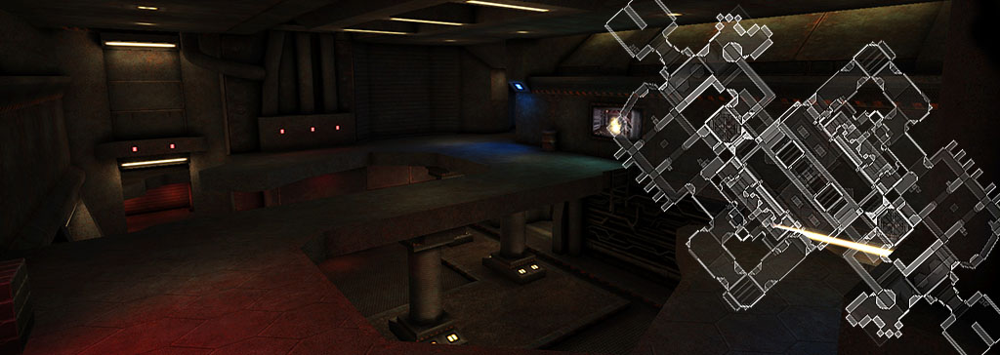
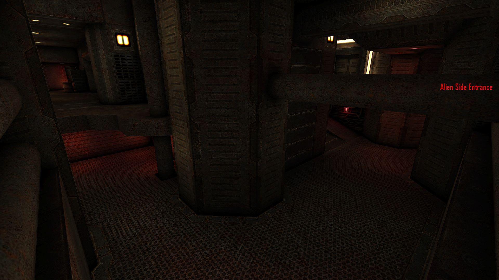
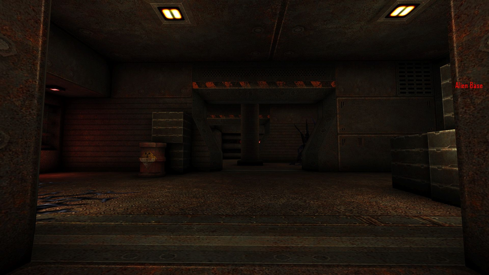
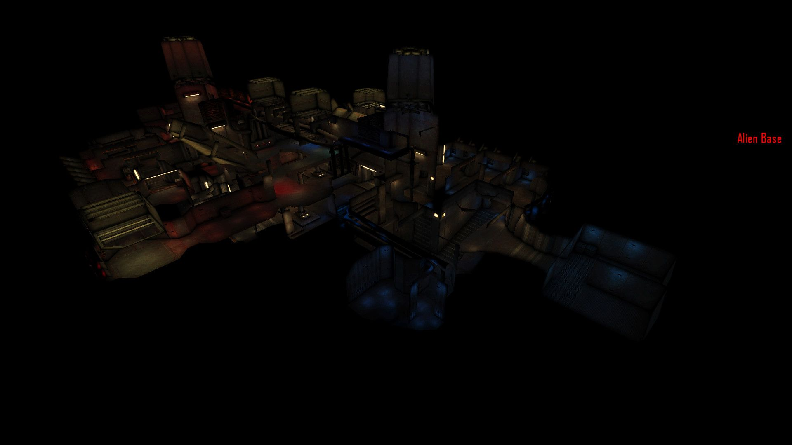

# UTCSUD - Game Level For Tremulous
 

## Overview: UTCS Remastered

UTCSUD is a game level by Matthias "Masmblr" Peters for the open source game [_Tremulous_](https://tremulous.net/).

Map Description: 
> This is a Tremulous map that pays homage to Adam "Chompers" Wilkinson's iconic layout from UTCS, while presenting an fresh and revitalized gaming experience. Constructed from the ground up, this map utilizes the eX Texture Pack to elevate its visuals.
> 
> Prepare to be enthralled by not one, but two versions of this map. The standard Tremulous map will captivate you with its refined design and strategic gameplay. However, for those seeking an even more immersive adventure, the experimental Tremulous 1.3 version (see branch) awaits. This rendition boasts Bumpmapping, Sun-Shafts support and a variety of other effects that will leave you in awe. You will need to download the [Tremulous 1.3 client](http://files.grangerhub.org/#files%2Fdownloads%2Fclients%2Falpha).
> 
> Each team will find two distinct Stage doors at their disposal. The first door, located in the heart of each team's territory, opens its gateway upon reaching Stage 2. The second door, situated in the rear of each team's domain, unlocks during Stage 3.
 
* * *

## Screenshots:
Tremulous screenshots (4.4): </br>
[](meta/preview_levelshots/1.jpg)
[](meta/preview_levelshots/2.jpg)
[](meta/preview_levelshots/3.jpg)
[](meta/preview_levelshots/4.jpg)
[](meta/preview_levelshots/5.jpg)
[](meta/preview_levelshots/6.jpg)
[](meta/preview_levelshots/7.jpg)
[](meta/preview_levelshots/8.jpg)
[](meta/preview_levelshots/9.jpg)
[](meta/preview_levelshots/10.jpg)
[](meta/preview_levelshots/11.jpg)
[](meta/preview_levelshots/12.jpg)

## Version History: **Tremulous**
| Version: | Date:        | Status: | Release Build (.pk3):       
| ------- | ------------- | ------: | -----------------: |
| 1.0 - 3.0    | 01/01/2015  | alpha | :x:        |     
| 4.0     | 16/10/2015  | alpha | :x:        |     
| 4.1     | 19/10/2015  | beta | :x:        |    
| 4.2     | 07/11/2015  | beta | :x:        |  
| 4.3     | 08/11/2015  | beta | :x:        |  
| 4.4     | 06/08/2023  | final | [💾](https://github.com/Masmblr/map-UTCSUD_src/releases/) |

## How-To
**Binary**:
1. Download the release package.
2. Save the *.pk3 file to the following directory: `/%PATH%/Tremulous/base/`.
3. Start the Tremulous game and select "Create Server" with the desired map.

**Source**:
1. Download the [source release](https://github.com/Masmblr/map-UTCSUD_src/releases/) and the [tremulous-common-files](https://github.com/Masmblr/tremulous-map-common/releases/tag/v1.0).
2. Extract the files to the default installation directory. It should look like this:

```
DRIVE:/%PATH%/tremulous/
|   tremulous.exe
|   tremulous.x86
|   ...
+---base
|   |   autogen.cfg
|   |   data-1.1.0.pk3
|   |   map-atcs-1.1.0.pk3
|   |   ...
|   +---env
|   +---maps 
|   +---models 
|   +---scripts
|   +---sounds
|   \---textures
```
1. Download [NetRadiant Level Editor](https://netradiant.gitlab.io/page/download/).
2. Launch NetRadiant and select "Tremulous" as your game setting.
3. Open the '.map' file located in the directory `/%PATH%/tremulous/base/maps` and, from the menu, choose 'Build -> 'Build with final settings.'
4. Start the Tremulous game with `-sv_pure 0 -devmap MAPNAME`. Make sure to replace "MAPNAME" with the actual name of the map you compiled.

## Development Tools:
Photoshop CS6 \
[Audacity](https://www.audacityteam.org/) \
[NetRadiant](https://netradiant.gitlab.io/) \
[Q3Map2](http://q3map2.robotrenegade.com/)

## Related Resources:
Official Tremulous website: https://tremulous.net </br>
NET Radiant Level-Editor: https://netradiant.gitlab.io </br>
Master-Server-List: http://dpmaster.deathmask.net/?game=tremulous </br>
Unofficial successor "Unvanquished": https://unvanquished.net

## Legal Information and Attribution
Some assets may be derivative works or subject to different licenses. Please refer for author and license details. Note that some files may have been modified. Below is a list of files and their legal statuses.

***
levelshots\utcsud.jpg <sup>[1](#Credit-1)</sup> \
maps\utcsud.map <sup>[1](#Credit-1)</sup> \
scripts\shaderlist.txt <sup>[1](#Credit-1)</sup> \
scripts\utcsud.arena <sup>[1](#Credit-1)</sup> \
scripts\utcsud.shader <sup>[1](#Credit-1)</sup> \
textures\utcsud\blk.jpg <sup>[1](#Credit-1)</sup> \
textures\utcsud\credits.jpg <sup>[1](#Credit-1)</sup> \
textures\utcsud\credits_lines.jpg <sup>[1](#Credit-1)</sup> \
textures\utcsud\utcsud_01.jpg <sup>[2](#Credit-2)</sup> \
textures\utcsud\utcsud_02.jpg <sup>[2](#Credit-2)</sup> \
textures\utcsud\utcsud_03.jpg <sup>[1](#Credit-1)</sup> \
textures\utcsud\utcsud_03_blend.jpg <sup>[1](#Credit-1)</sup> \
textures\utcsud\utcsud_03_blend_blue.jpg <sup>[1](#Credit-1)</sup> \
textures\utcsud\utcsud_03_blend_red.jpg <sup>[1](#Credit-1)</sup> \
textures\utcsud\utcsud_03b.jpg <sup>[1](#Credit-1)</sup> \
textures\utcsud\utcsud_03r.jpg <sup>[1](#Credit-1)</sup> \
textures\utcsud\utcsud_04.jpg <sup>[2](#Credit-2)</sup> \
textures\utcsud\utcsud_04_blend.jpg <sup>[2](#Credit-2)</sup> \
textures\utcsud\utcsud_05.jpg <sup>[2](#Credit-2)</sup> \
textures\utcsud\utcsud_06.jpg <sup>[2](#Credit-2)</sup> \
textures\utcsud\utcsud_07.jpg <sup>[2](#Credit-2)</sup> \
textures\utcsud\utcsud_08.jpg <sup>[2](#Credit-2)</sup> \
textures\utcsud\utcsud_09.jpg <sup>[2](#Credit-2)</sup> \
textures\utcsud\utcsud_10.jpg <sup>[2](#Credit-2)</sup> \
textures\utcsud\utcsud_11.jpg <sup>[2](#Credit-2)</sup> \
textures\utcsud\utcsud_12.jpg <sup>[2](#Credit-2)</sup> \
textures\utcsud\utcsud_13.jpg <sup>[2](#Credit-2)</sup> \
textures\utcsud\utcsud_14.jpg <sup>[2](#Credit-2)</sup> \
textures\utcsud\utcsud_15.jpg <sup>[2](#Credit-2)</sup> \
textures\utcsud\utcsud_16.jpg <sup>[2](#Credit-2)</sup> \
textures\utcsud\utcsud_17.jpg <sup>[2](#Credit-2)</sup> \
textures\utcsud\utcsud_18.jpg <sup>[2](#Credit-2)</sup> \
textures\utcsud\utcsud_19.jpg <sup>[2](#Credit-2)</sup> \
textures\utcsud\utcsud_20.jpg <sup>[2](#Credit-2)</sup> \
textures\utcsud\utcsud_20_blend.jpg <sup>[2](#Credit-2)</sup> \
textures\utcsud\utcsud_21.jpg <sup>[2](#Credit-2)</sup> \
textures\utcsud\utcsud_22.jpg <sup>[2](#Credit-2)</sup> \
textures\utcsud\utcsud_24.jpg <sup>[2](#Credit-2)</sup> \
textures\utcsud\wasser.jpg <sup>[1](#Credit-1)</sup> \
env\utcsud\ud_bk.jpg <sup>[3](#Credit-3)</sup> \
env\utcsud\ud_dn.jpg <sup>[3](#Credit-3)</sup> \
env\utcsud\ud_ft.jpg <sup>[3](#Credit-3)</sup> \
env\utcsud\ud_lf.jpg <sup>[3](#Credit-3)</sup> \
env\utcsud\ud_rt.jpg <sup>[3](#Credit-3)</sup> \
env\utcsud\ud_up.jpg <sup>[3](#Credit-3)</sup>
***

### Credit-1
[Matthias "Masmblr Peters"](mailto:masmblr@gmail.com) \
Content: Map, Textures, Shaders \
License: [MIT License](https://opensource.org/license/mit/).
(See "LICENSE" file for more Informations.)

### Credit-2
[Yves Allaire](http://www.evillair.net/) \
Content: eX Textures \
License: Attribution License

### Credit-3
[Stijn “Ingar” Buys](http://ingar.intranifty.net/) \
Content: Skybox \
License: Attribution License

For all other content, their respective licensing rules and other legal provisions apply.

## Special Thanks:
* id Software for Quake3
* Dark Legion Development for Tremulous
* Team Xonotic for NetRadiant 
